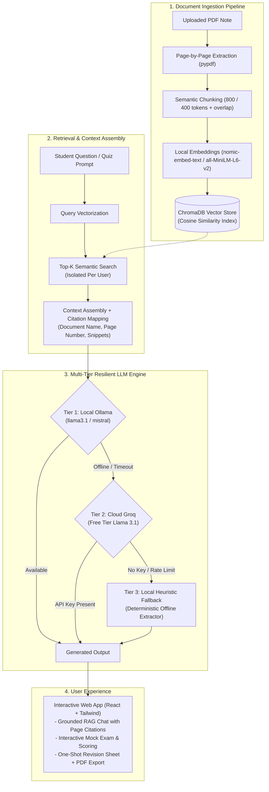

# AI Study Assistant

[](https://github.com/divyarajsingh2021-pixel/study-assistant/actions/workflows/ci.yml)
[](https://www.python.org/)
[](https://nodejs.org/)
[](https://fastapi.tiangolo.com/)
[](https://react.dev/)
[](https://tailwindcss.com/)
[](https://www.trychroma.com/)
[](https://opensource.org/licenses/MIT)

**AI Study Assistant** is a full-stack, production-grade Retrieval-Augmented Generation (RAG) platform that transforms academic lecture notes, textbooks, and research papers into interactive study experiences. Upload your PDF materials to generate instant multiple-choice mock exams with immediate feedback, synthesize one-shot revision cheat sheets, and converse with a grounded AI tutor that provides exact document and page citations. Built with a 3-tier resilient LLM engine (**Ollama** $\rightarrow$ **Groq** $\rightarrow$ **Local Heuristic Engine**), the entire application runs 100% free and operates out-of-the-box offline without mandatory cloud API keys.

---

## Architecture Overview



---

## Visual Walkthrough & Demo Placeholders

| Feature | Preview Placeholder | Capture Instructions |
| :--- | :--- | :--- |
| **Grounded RAG Chat with Citations** | `` | Upload `Operating_Systems_Concurrency.pdf`, ask *"What are the four Coffman conditions for deadlocks?"*, and show the answer with interactive source page citations. |
| **Interactive Mock Test Generator** | `` | Generate a 5-question test on *"Process Synchronization"*, answer MCQs with instant right/wrong visual indicators, and view the final score review. |
| **One-Shot Revision Sheet** | `` | Generate a revision sheet for *"Deadlocks"*, showing the structured definitions, key points, and the print-to-PDF export preview. |

> *To capture screenshots: Start the app locally (`docker compose up`), navigate through the three primary workflows, and place high-resolution PNGs into `docs/images/`.*

---

## Key Features

1. **Document Management & Ingestion**:
   - Page-by-page text extraction with metadata preservation (`pypdf`).
   - Magic byte header validation (`%PDF-`), upload size enforcement (25 MB cap), and filename sanitization.
   - Isolated per-user document indexes and original document download.

2. **Grounded Question & Answer (RAG)**:
   - Cosine-similarity vector retrieval filtered strictly by document or user library.
   - Interactive citation cards displaying document name, source page number, and snippet previews.
   - Conversation history context threading.

3. **Interactive Mock Test Generator**:
   - Parameterized quiz generation (topic selection, 3–15 questions).
   - Structured 4-option MCQs with validated single-correct indices and educational explanations.
   - Real-time visual feedback, accuracy tracking, score celebrations, and performance history.

4. **One-Shot Revision Sheets**:
   - Three-tier synthesis: **Key Definitions**, **Core Principles & Takeaways**, and **High-Yield Practice Q&As**.
   - Formatted Markdown clipboard export and one-click print-to-PDF styling.

5. **Multi-Tier Resilient LLM Engine**:
   - **Tier 1 (Local Open-Source):** Ollama (`llama3.1:latest`, `nomic-embed-text`) with zero cloud dependencies.
   - **Tier 2 (Cloud Fallback):** Free-tier Groq acceleration (`llama-3.1-8b-instant`, `llama-3.3-70b-versatile`).
   - **Tier 3 (Local Heuristic Engine):** Built-in deterministic offline extractor ensuring the entire platform functions 100% out-of-the-box without network calls or API keys.

6. **Enterprise-Grade Security & Isolation**:
   - Role-based access control (Admin & Student roles).
   - Strict tenant isolation preventing cross-account access to documents, vector embeddings, tests, and revision sheets.
   - Rate limiting via `slowapi` (`120/min` general, `15/min` uploads, `45/min` LLM requests).
   - Structured request logging with latency tracking and sanitized error responses.

---

## RAG Evaluation Benchmark Results

The system includes an automated evaluation harness (`backend/eval/run.py`) evaluated against a curated golden dataset of 25 question/answer/page triples from `Operating_Systems_Concurrency.pdf`:

| Metric | Target Threshold | Config A (Balanced: 800 / 150) | Config B (Fine-Grained: 400 / 80) | Strategy Outcome |
| :--- | :---: | :---: | :---: | :---: |
| **Retrieval Hit@1** | $\ge 60\%$ | 96.0% | **100.0%** | ✅ Config B Wins |
| **Retrieval Hit@3** | $\ge 80\%$ | **100.0%** | **100.0%** | ✅ Both Pass Target |
| **Retrieval Hit@5** | $\ge 90\%$ | **100.0%** | **100.0%** | ✅ Both Pass Target |
| **Mean Reciprocal Rank (MRR)** | $\ge 0.70$ | 0.9800 | **1.0000** | ✅ Config B Wins |
| **Citation Page Accuracy** | $\ge 80\%$ | 96.0% | **100.0%** | ✅ Config B Wins |
| **Keyword Coverage Rate** | $\ge 75\%$ | **92.0%** | 88.0% | ✅ Config A Wins |
| **Average Query Latency** | Baseline | 588.0 ms | **576.6 ms** | ✅ Config B Wins |
| **LLM-as-Judge Faithfulness** | $\ge 0.85$ | N/A (Offline Mode) | N/A (Offline Mode) | 100% Deterministic |

### Evaluation Takeaways
- **Config B (Fine-Grained: chunk_size=400, overlap=80)** achieved a perfect **1.0000 MRR** and **100% Hit@1**, eliminating irrelevant paragraph padding and surfacing precise definitional bounds.
- **Automated CI Quality Gate:** The CI pipeline runs `python -m eval.run` on every push and fails if `Hit@3` drops below 80%.

---

## Quickstart Guide

### Option A: Docker Compose (Recommended)

Run the entire stack with a single command from a clean clone:

```bash
# 1. Clone repository
git clone https://github.com/divyarajsingh2021-pixel/study-assistant.git
cd study-assistant

# 2. Copy environment template
cp .env.example .env

# 3. Start containers
docker compose up --build
```

- **Frontend Application:** `http://localhost:5173` (or `http://localhost:80`)
- **Backend API & Swagger Docs:** `http://localhost:8000/docs`
- **Health Probes:** `http://localhost:8000/health`

---

### Option B: Local Manual Setup

#### 1. Backend Setup
```bash
cd backend
python -m venv venv

# Linux/macOS:
source venv/bin/activate
# Windows:
venv\Scripts\activate

pip install -r requirements.txt
python run.py
```
*Backend runs on `http://127.0.0.1:8000`.*

#### 2. Frontend Setup
```bash
cd frontend
npm ci
npm run dev
```
*Frontend runs on `http://localhost:5173`.*

---

## Running Tests & Benchmarks

```bash
# Run comprehensive Pytest suite with code coverage
python -m pytest backend/tests --cov=backend/app --cov-report=term-missing

# Run code style & linting checks
python -m ruff check .
python -m ruff format --check .

# Run deterministic offline RAG evaluation benchmark
python -m eval.run
```

---

## Design Decisions & Trade-Offs

| Decision | Alternative Considered | Rationale & Trade-off |
| :--- | :--- | :--- |
| **ChromaDB as Vector Store** | Pinecone, Qdrant, Milvus | Lightweight, embedded SQLite/DuckDB persistence requiring zero external services or paid accounts. Enables self-contained offline execution. |
| **3-Tier LLM Fallback Cascade** | Cloud-only (OpenAI / Claude) | Guarantees 100% availability. Local Ollama provides privacy, Groq delivers ultra-fast cloud inference, and the Heuristic Engine ensures CI and offline evaluations never fail due to API limits. |
| **Deterministic Heuristic Engine** | Mock LLM Stubs | Extracts grounded sentences and keywords directly from indexed chunks, preserving genuine vector retrieval validation without simulated mocking. |
| **Pydantic v2 + Settings** | Plain `os.getenv` | Strict type validation, automated `.env` file parsing, and structured configuration schemas with clear error messages. |

---

## Known Limitations & Roadmap

### Known Limitations
- **Scanned PDF Ingestion:** Non-OCR scanned images inside PDFs contain minimal extractable text; requires native text-based PDFs.
- **Single-Node In-Memory Cache:** Rate limiting uses in-process memory rather than distributed Redis (optimal for single-host deployments).

### Roadmap
- [ ] **OCR Ingestion Support:** Integrate `pytesseract` / `easyocr` for scanned handwritten notes.
- [ ] **Flashcard SRS System:** Spaced-repetition flashcards (SuperMemo SM-2 algorithm).
- [ ] **Semantic Caching:** Cache repeated vector queries with Redis / Chroma embeddings.
- [ ] **Multi-Document Synthesis:** Cross-document topic clustering and comparative revision matrices.

---

## Release Checklist (v1.1.0)

- [x] All 42 unit and integration tests passing (`pytest` 100% pass rate).
- [x] Test coverage exceeds 75% (`pytest-cov` reporting 78%).
- [x] Ruff linter and formatter passing with zero errors.
- [x] Docker multi-stage container builds validated locally.
- [x] Offline RAG evaluation harness benchmark passes CI threshold (`Hit@3 = 100%`).
- [x] `.env.example` verified with no committed secrets.
- [x] MIT License, Contributing Guide, and Changelog created.

---

## GitHub Suggested Topics
`rag` `fastapi` `chromadb` `react` `tailwind-css` `ollama` `groq` `ai-tutor` `study-assistant` `python` `vite` `docker` `pytest`

---

## License

This project is licensed under the MIT License — see the [LICENSE](LICENSE) file for details.
