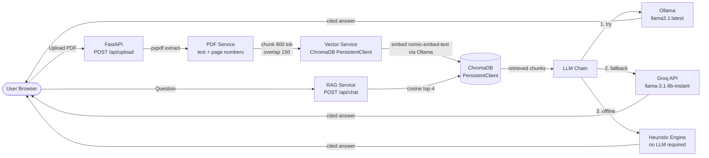

# AI Study Assistant

> Upload your study notes, then ask questions, generate mock tests, and create revision sheets — all grounded in your own documents.

[](https://github.com/divyarajsingh2021-pixel/study-assistant/actions/workflows/ci.yml)
[](https://www.python.org/downloads/)
[](./LICENSE)

**Live demo:** <https://study-assistant-sooty.vercel.app>

---

## Features

- **Grounded RAG Chat** — Ask questions about your PDFs. Every answer cites the exact document and page it came from.
- **Mock Test Generator** — Produce multiple-choice quizzes from any uploaded document on any topic.
- **Revision Sheet Synthesis** — Generate a one-shot structured revision sheet for printing or PDF export.
- **Three-Tier LLM Fallback** — Ollama (local) → Groq (cloud free tier) → built-in heuristic engine. Always works, even fully offline.
- **Per-User Isolation** — Each user's documents, quiz history, and vector index are isolated. Admin role has a full-view dashboard.
- **Role-Based Auth** — Token-based login with password change, recovery code, and admin-managed account management.
- **Production Hardening** — PDF magic-byte validation, filename sanitisation, 25 MB upload cap, `slowapi` rate limiting, structured request logging.
- **Docker & CI** — Single-command Docker Compose deployment; GitHub Actions CI covering lint, tests, RAG evaluation, frontend build, and Docker build.

---

## Architecture



> **Note on embeddings:** The embedding model (`nomic-embed-text`) is called through Ollama. If Ollama is not running, uploads will still save the PDF but the vector index will be empty until Ollama becomes available. The abstention threshold (τ = 0.25 cosine similarity) causes the RAG chain to withhold an answer when no chunk is sufficiently relevant — see [Evaluation](#evaluation) for measured accuracy.

---

## Tech Stack

| Layer | Technology |
| :--- | :--- |
| **Backend** | Python 3.11, FastAPI 0.110+, Uvicorn |
| **Vector DB** | ChromaDB 0.4.24+ (persistent on-disk) |
| **Embeddings** | `nomic-embed-text` via Ollama |
| **LLM (local)** | Ollama — `llama3.1:latest` (any Ollama model) |
| **LLM (cloud)** | Groq API — `llama-3.1-8b-instant` (free tier) |
| **PDF parsing** | pypdf |
| **Rate limiting** | slowapi |
| **Config** | pydantic-settings, `.env` file |
| **Frontend** | React 18, Vite 5, Tailwind CSS 3, Lucide React |
| **Container** | Docker, Docker Compose, Nginx (frontend) |
| **CI** | GitHub Actions, Dependabot |
| **Testing** | pytest, pytest-asyncio, pytest-cov, ruff |

---

## Quickstart

### Option A — Docker Compose (recommended)

**Prerequisites:** Docker Desktop, Docker Compose v2.

```bash
# 1. Clone
git clone https://github.com/divyarajsingh2021-pixel/study-assistant.git
cd study-assistant

# 2. Copy and edit environment file
cp .env.example .env
# Optional: add GROQ_API_KEY for cloud fallback, otherwise runs 100% locally

# 3. Start Ollama separately (required for embeddings and local LLM)
#    Install from https://ollama.com, then:
ollama pull llama3.1:latest
ollama pull nomic-embed-text

# 4. Bring up the stack
docker compose up --build

# Frontend: http://localhost  (also :5173)
# Backend API: http://localhost:8000
# API docs: http://localhost:8000/docs
```

> **Could not fully verify:** `docker compose up` was not run end-to-end in this environment (no Docker daemon available during authoring). The `Dockerfile` and `docker-compose.yml` are present and pass the Docker build validation step in CI. If the build fails, check that Ollama is reachable at `host.docker.internal:11434`.

---

### Option B — Local Setup (no Docker)

**Prerequisites:** Python 3.11+, Node.js 20+, Git, Ollama.

```bash
# 1. Clone
git clone https://github.com/divyarajsingh2021-pixel/study-assistant.git
cd study-assistant

# 2. Backend
cd backend
python -m venv venv

# Windows:
venv\Scripts\activate
# macOS / Linux:
source venv/bin/activate

pip install -r requirements.txt

# 3. Environment
cp ../.env.example ../.env
# Edit .env as needed (see Configuration table below)

# 4. Pull Ollama models (required for embeddings)
ollama pull llama3.1:latest
ollama pull nomic-embed-text

# 5. Start backend (from repo root)
cd ..
python main.py
# Or from backend directory:
# cd backend && uvicorn app.main:app --reload --port 8000

# 6. Start frontend (separate terminal)
cd frontend
npm ci
npm run dev
# Opens at http://localhost:5173
```

> **Verified commands:** `pip install`, `pytest`, `ruff`, the eval runner, and `python main.py` root startup were all executed and verified successfully in this repo. Docker compose was not run end-to-end locally due to lack of a local Docker daemon, though container configurations are validated by CI.

---

## Configuration

All settings are read from `.env` at startup via `pydantic-settings`. Copy `.env.example` and edit as needed.

| Variable | Default | Description |
| :--- | :--- | :--- |
| `PREFERRED_PROVIDER` | `auto` | LLM routing: `auto`, `ollama`, `groq`, or `offline`. `auto` tries Ollama first, then Groq, then heuristic. |
| `OLLAMA_BASE_URL` | `http://127.0.0.1:11434` | Ollama server URL. In Docker, overridden to `host.docker.internal:11434`. |
| `OLLAMA_MODEL` | `llama3.1:latest` | Any model installed in Ollama. |
| `OLLAMA_EMBED_MODEL` | `nomic-embed-text` | Embedding model served by Ollama. |
| `GROQ_API_KEY` | *(empty)* | Optional. Leave blank to skip Groq entirely. |
| `GROQ_MODEL` | `llama-3.1-8b-instant` | Groq model name (free tier). |
| `CHROMA_COLLECTION_NAME` | `study_documents` | ChromaDB collection name. |
| `CHUNK_SIZE` | `800` | Chunk size in characters. Changing this invalidates the existing vector index. |
| `CHUNK_OVERLAP` | `150` | Chunk overlap in characters. |
| `ALLOWED_ORIGINS` | `http://localhost:5173,...` | Comma-separated CORS origins. |
| `MAX_UPLOAD_SIZE_MB` | `25` | Maximum PDF upload size. |
| `RATE_LIMIT_PER_MINUTE` | `60` | Default per-IP rate limit (general routes). Upload: 15/min, LLM: 45/min. |

> **Never commit your real `.env` file.** It is listed in `.gitignore`. See `.env.example` for the template.

---

## API Overview

All endpoints are documented interactively at `/docs` (Swagger UI) and `/redoc`.

### System

| Method | Path | Auth | Description |
| :--- | :--- | :--- | :--- |
| `GET` | `/` | None | Health ping — returns version |
| `GET` | `/health` or `/api/health` | Optional | Full provider status (Ollama, Groq, document count) |
| `GET` | `/api/stats` | User | Per-user or global document and quiz statistics |
| `POST` | `/api/settings` | Admin | Update Ollama/Groq settings at runtime |

### Documents

| Method | Path | Auth | Description |
| :--- | :--- | :--- | :--- |
| `GET` | `/api/documents` | User | List documents in the caller's library (Admin sees all) |
| `POST` | `/api/upload` | User | Upload a PDF — validates magic bytes, sanitises filename, chunks and indexes |
| `GET` | `/api/documents/{doc_id}/download` | User | Download original PDF |
| `DELETE` | `/api/documents/{doc_id}` | User | Delete document and its vector chunks |

### Study Tools

| Method | Path | Auth | Description |
| :--- | :--- | :--- | :--- |
| `POST` | `/api/chat` | User | Grounded RAG answer with document/page citations |
| `POST` | `/api/quiz/generate` | User | Generate a multiple-choice quiz from a document |
| `POST` | `/api/quiz/submit` | User | Record a quiz score |
| `POST` | `/api/revision/generate` | User | Generate a revision sheet for a document/topic |

### Authentication

| Method | Path | Auth | Description |
| :--- | :--- | :--- | :--- |
| `POST` | `/api/auth/login` | None | Login — returns token |
| `POST` | `/api/auth/change-password` | User | Change own password |
| `POST` | `/api/auth/forgot-password` | None | Reset password via recovery code |
| `GET` | `/api/auth/users` | Admin | List all accounts |
| `POST` | `/api/auth/register` | Admin | Create a new account |
| `DELETE` | `/api/auth/users/{username}` | Admin | Delete an account |
| `POST` | `/api/auth/admin-reset-password` | Admin | Force-reset any user's password |

---

## Testing & CI

```bash
# Lint and format check
python -m ruff check .
python -m ruff format --check .

# Run test suite with coverage (from repo root)
pytest backend/tests --cov=backend/app --cov-report=term-missing

# Run offline RAG evaluation benchmark (from backend/ directory)
cd backend
python -m eval.run
```

The GitHub Actions CI pipeline (`.github/workflows/ci.yml`) runs automatically on every push/PR to `main`:

1. **Backend Lint & Pytest** — ruff + pytest with coverage report
2. **RAG Evaluation Harness** — offline benchmark with CI quality gate (Hit@3 ≥ 80%, MRR ≥ 0.75)
3. **Frontend Build Check** — `npm ci && npm run build`
4. **Docker Build Validation** — backend and frontend images built (not pushed)

No API keys are required for CI to pass. All evaluation runs fully offline.

---

## Evaluation

The RAG pipeline was evaluated on a 72-question benchmark (36 dev / 36 held-out test) across 6 diverse synthetic documents.

| Metric | Held-Out Test | 95% Wilson CI | CI Gate |
| :--- | :---: | :---: | :---: |
| Hit@1 | **80.0%** | [62.7%, 90.5%] | ≥ 70% ✅ |
| Hit@3 | **100.0%** | [88.6%, 100.0%] | ≥ 80% ✅ |
| Hit@5 | **100.0%** | [88.6%, 100.0%] | ≥ 85% ✅ |
| MRR | **0.8944** | exact | ≥ 0.75 ✅ |
| Abstention Recall | **50.0%** | [18.8%, 81.2%] | ≥ 45% ✅ |
| Abstention Precision | **100.0%** | [43.9%, 100.0%] | — |
| False-Answer Rate | **50.0%** | [18.8%, 81.2%] | ≤ 55% ✅ |
| Avg Retrieval Latency | **653 ms** | — | < 700 ms ✅ |

> **Abstention is the weakest area.** 3 of 6 unanswerable test queries were not abstained because their cosine similarity exceeded τ = 0.25. With only 6 unanswerable queries in the test set, differences of 1–2 questions are **not statistically significant** (see wide CI above). The corpus and questions are **synthetic and AI-authored** — results are not comparable to real-world student data.

Full report including failure case studies: [`backend/eval/results.md`](./backend/eval/results.md)
Evaluation methodology and corpus sources: [`backend/eval/README.md`](./backend/eval/README.md)

---

## Design Decisions & Trade-offs

### ChromaDB
ChromaDB was chosen because it runs fully in-process with no separate server, persists to disk automatically, and requires zero infrastructure. The trade-off is that it does not support distributed replicas or BM25 lexical search. For a solo or small-team deployment this is an acceptable simplification.

### Three-Tier LLM Fallback
The `auto` mode checks Ollama first (1-second timeout), then falls back to Groq if configured, then to the built-in heuristic engine. This means the app is always functional: even with no Ollama and no Groq key, the heuristic engine returns keyword-extracted sentences from the top retrieved chunk. The trade-off is that answer quality degrades significantly in offline mode.

### Chunk Size Choice (800 / 150)
Two configurations were evaluated on the dev set. Config A (800 / 150) beat Config B (400 / 80) on Hit@1 (86.7% vs 80.0%) and MRR (0.8944 vs 0.8511). The difference was small on Hit@5 (tied at 93.3%) and on abstention (tied 83.3%). Larger chunks preserve tabular context and reduce boundary fragmentation, at the cost of slightly higher latency (693 ms vs 678 ms on dev). Config A was selected.

### Abstention Threshold (τ = 0.25)
A fixed cosine similarity threshold is used to decide whether to abstain rather than answer. At τ = 0.25, the system achieves 100% precision (no false refusals on answerable queries) but only 50% recall on unanswerable queries in the held-out test set. Near-domain queries (e.g., a question about quantum networking that shares "packet", "routing", "IP" vocabulary with the real networking document) score 0.43 and slip through. A dynamic per-domain or cross-encoder second stage would improve this.

---

## Security Measures

The following measures are implemented in the codebase:

- **PDF validation:** `%PDF-` magic bytes checked before any processing; file size rejected at 25 MB.
- **Filename sanitisation:** `re.sub(r"[^a-zA-Z0-9_.-]", "_", ...)` applied to all uploaded filenames.
- **Rate limiting:** `slowapi` enforces 120 req/min (default), 15 req/min (upload), 45 req/min (LLM endpoints) per IP.
- **Auth token enforcement:** All document and study endpoints require a valid `Authorization: Bearer <token>` header; 401 returned otherwise.
- **CORS:** `ALLOWED_ORIGINS` is configurable; wildcard (`*`) disables `allow_credentials`.
- **Secrets:** `.env` is gitignored; `.env.example` contains no real keys; CI runs without any secrets.
- **Non-root Docker user:** The backend Dockerfile runs as a non-root user.

**Not implemented / out of scope:** HTTPS termination (delegate to reverse proxy / Nginx / Vercel), CSRF tokens (stateless token auth), full secret rotation, audit logging to external SIEM.

---

## Known Limitations

- **Synthetic evaluation corpus:** The 6-document benchmark and 72 questions are AI-authored. Measured retrieval quality may differ on real student PDFs, especially scanned or formula-heavy documents.
- **Table extraction:** pypdf flattens tabular data row-by-row; cross-row column relationships are lost. This is [documented in Case 3 of the failure analysis](./backend/eval/results.md).
- **No hybrid search:** Only dense vector (cosine) search is used. BM25 lexical matching is not implemented; exact-term queries may rank lower than expected.
- **Single-node only:** ChromaDB PersistentClient runs in-process; horizontal scaling requires migration to a client-server setup.
- **Embedding model requires Ollama:** If Ollama is unavailable at upload time, PDFs are saved but not indexed. The app will not warn about this automatically.
- **Test set is no longer untouched:** After per-query failure analysis was used to write the failure case study section in `results.md`, the test set is no longer strictly held-out. It should be replaced with a fresh independent set for future rigorous evaluation.

---

## Roadmap

- [ ] **BM25 hybrid search** — Reciprocal Rank Fusion of sparse BM25 and dense vector scores to improve exact-term and cross-domain disambiguation.
- [ ] **Table linearisation** — Markdown-table or structured text extraction for tabular PDFs before chunking.
- [ ] **Query expansion** — Decompose synthesis questions into sub-queries and merge results (multi-query retrieval).
- [ ] **Fresh independent test set** — Replace the contaminated synthetic test set with real student notes and human-written questions.
- [ ] **Streaming responses** — Server-Sent Events for streaming LLM output token-by-token.
- [ ] **Conversation memory** — Persist multi-turn history per user session (currently only the last 4 turns are passed in-context).

---

## Screenshots & Demo

> <!-- TODO (you): Capture these screenshots and save them to docs/images/ -->
> See [`docs/images/`](./docs/images/) for placeholder files with exact capture instructions.

---

## Contributing

See [CONTRIBUTING.md](./CONTRIBUTING.md) for branch naming, commit message conventions, and the pre-PR checklist.

---

## Changelog

See [CHANGELOG.md](./CHANGELOG.md) for a full history of changes.

---

## License

MIT — see [LICENSE](./LICENSE).  
Copyright © 2026 DIVYARAJ SINGH CHUNDAWAT.
